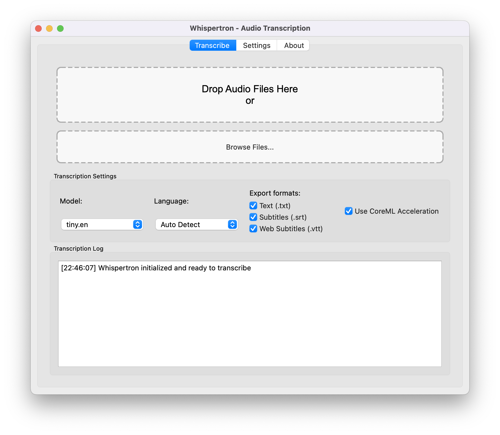
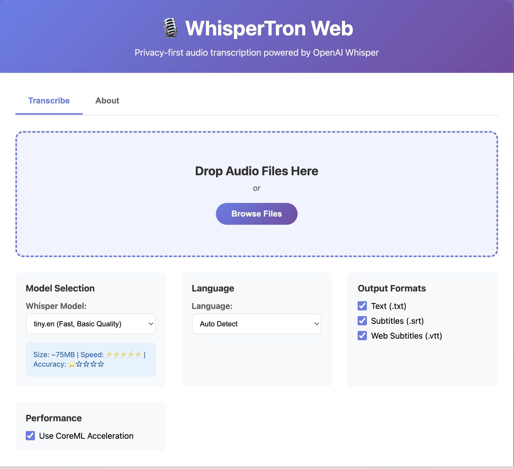

# WhisperTron 🎙️ [](https://opensource.org/licenses/MIT) [](https://www.apple.com/mac/m-series/)

> A lightning-fast, privacy-first audio transcription system powered by OpenAI's Whisper model via whisper.cpp with Apple Silicon optimizations.

WhisperTron lets you transcribe voice memos, interviews, podcasts and more - all on your local machine with no data ever leaving your computer.

<p align="center">
  <table>
    <tr>
      <td align="center">
        
        <br><b>Desktop GUI Interface</b>
      </td>
      <td align="center">
        
        <br><b>Web Interface</b>
      </td>
    </tr>
  </table>
</p>

## ✨ Features

- **🔒 Completely Local**: All processing happens on your machine - no data sent to any external service
- **⚡ Apple Silicon Optimized**: Uses Metal and CoreML acceleration for much faster transcription on M1/M2/M3/M4 Macs
- **📝 Multiple Output Formats**: Generates text (.txt), subtitles (.srt), and web subtitles (.vtt)
- **🖱️ User-Friendly Interfaces**: Simple drag-and-drop GUI and web interface for audio files
- **🧠 Model Selection**: Choose from various Whisper models (tiny.en through large-v3)
- **📱 Voice Memo Compatible**: Works directly with iOS Voice Memos (.m4a files)
- **⏱️ Timestamped Output**: Creates subtitles with accurate timestamps

## 🚀 Getting Started

### Prerequisites

- macOS (Apple Silicon recommended for best performance)
- Python 3.11+
- FFmpeg (for audio format conversion)
- Git

### Installation

1. Clone this repository:
   ```bash
   git clone --recurse-submodules https://github.com/drewburchfield/whispertron.git
   cd whispertron
   ```

2. Run the setup script to initialize the environment and build whisper.cpp:
   ```bash
   chmod +x setup.sh
   ./setup.sh
   ```
   This script will:
   - Create a Python virtual environment
   - Install required packages
   - Clone and build whisper.cpp with Apple Silicon optimizations
   - Download the tiny.en model for initial testing
   - Set up necessary directory structure

3. Launch the application:
   ```bash
   # Desktop GUI interface
   python whispertron.py
   
   # Or web interface
   python whispertron-web.py
   ```

## 📖 Usage

### Desktop GUI Interface

1. Launch WhisperTron: `python whispertron.py`
2. Drag and drop audio files onto the application or use the "Browse Files" button
3. Select your desired model and output formats
4. Wait for transcription to complete
5. Transcribed files will be saved in the "exports" directory with timestamp-based folders

### Web Interface

1. Launch the web interface: `python whispertron-web.py`
2. Open your browser to `http://localhost:5001`
3. Drag and drop audio files or click "Browse Files" to upload
4. Configure transcription settings (model, language, output formats)
5. Monitor progress in real-time with the live console output
6. Download your transcribed files directly from the web interface
7. Files are also saved locally in the "web/exports" directory

The web interface provides the same powerful transcription capabilities as the desktop app but accessible through any modern web browser, making it perfect for remote access or when you prefer a browser-based workflow.

### Command Line Interface

For batch processing or automation, use the included CLI:

```bash
./transcribe.sh -m medium.en -f txt,srt,vtt recording.m4a
```

Options:
- `-m, --model MODEL`: Specify model to use (default: tiny.en)
- `-l, --language LANG`: Specify language code (default: auto-detect)
- `-f, --formats FORMATS`: Comma-separated output formats (default: txt,srt,vtt)
- `-h, --help`: Show help message

## 🧠 Models

WhisperTron supports the following models:

| Model | Size | Speed | Accuracy | Use Case |
|-------|------|-------|----------|----------|
| tiny.en | ~75MB | ⚡⚡⚡⚡⚡ | ⭐☆☆☆☆ | Quick testing, short clips |
| base.en | ~142MB | ⚡⚡⚡⚡ | ⭐⭐☆☆☆ | Short voice memos |
| small.en | ~466MB | ⚡⚡⚡ | ⭐⭐⭐☆☆ | Good balance for most uses |
| medium.en | ~1.5GB | ⚡⚡ | ⭐⭐⭐⭐☆ | High accuracy needs |
| large-v3 | ~3GB | ⚡ | ⭐⭐⭐⭐⭐ | Critical transcriptions |

To download additional models, run:
```bash
cd whisper.cpp && ./models/download-ggml-model.sh MODEL_NAME
```

> **Note**: The first time you use a model with CoreML, it will need to compile (may take up to 1 minute)

## 💡 Performance Tips

1. Start with the tiny.en model to test your setup (fastest but least accurate)
2. For longer recordings, medium.en offers a good balance of speed and accuracy
3. For critical transcriptions where accuracy is essential, use large-v3
4. M1/M2/M3/M4 Macs provide significantly better performance than Intel-based Macs

## 🗂️ Project Structure

- `src/`: Core transcription engine with Python interface to whisper.cpp
- `ui/`: PyQt6-based desktop user interface
- `web/`: Flask-based web interface with real-time progress tracking
- `bin/`: Executable binaries
- `models/`: Whisper model files location
- `exports/`: Output directory for transcribed files (desktop interface)
- `web/exports/`: Output directory for web interface transcriptions
- `whisper.cpp/`: C++ implementation of Whisper with Apple Silicon optimizations

## 🔧 Troubleshooting

- **No audio transcription**: Ensure FFmpeg is installed (`brew install ffmpeg` on macOS)
- **"Model not found" error**: Make sure you've downloaded the model you're trying to use
- **Performance issues**: Try a smaller model if transcription is too slow
- **M4A format issues**: The app should automatically convert these, but if not, manually convert to WAV
- **Web interface connection issues**: Check that port 5001 is available and not blocked by firewall
- **Web transcription stuck**: The web interface includes automatic polling backup if WebSocket connection drops

## 👥 Contributing

Contributions are welcome! Please check out our [Contributing Guidelines](CONTRIBUTING.md) for details on how to submit pull requests, report bugs, and suggest features.

## 📄 License

This project is licensed under the MIT License - see the [LICENSE](LICENSE) file for details.

## 👏 Acknowledgments

- [OpenAI Whisper](https://github.com/openai/whisper) - The original Whisper model
- [whisper.cpp](https://github.com/ggerganov/whisper.cpp) - C++ implementation with Apple Silicon optimization 

## 📬 Contact

Drew Burchfield - [drewburchfield.com](https://drewburchfield.com)

Project Link: [https://github.com/drewburchfield/whispertron](https://github.com/drewburchfield/whispertron)

---

<p align="center">
  Made with ❤️ in 2025
</p> 
